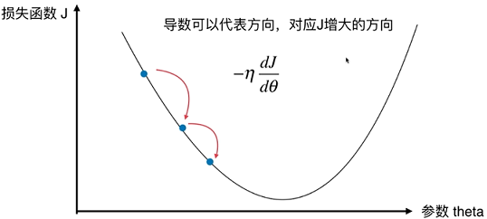
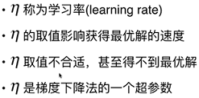
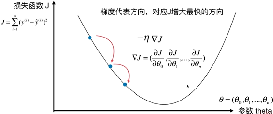
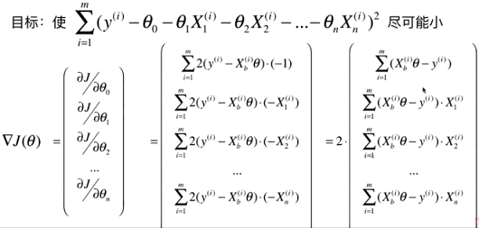
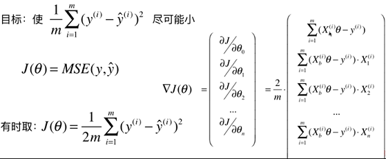
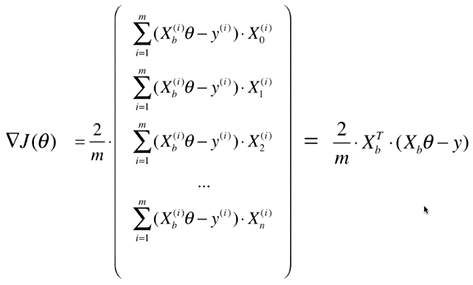
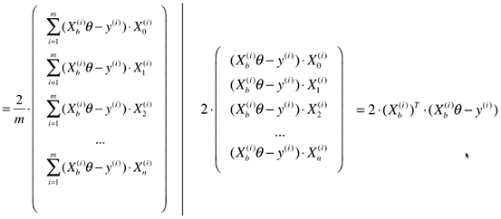
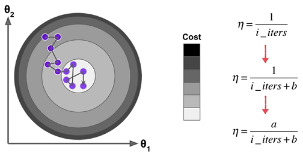
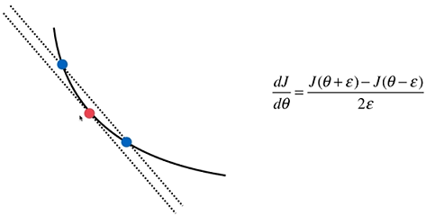

### 梯度下降法
- 不是一个机器学习算法
- 是一种基于搜索的最优化方法
- 作用： 最小化损失函数
- 梯度上升发：最大化一个效用函数

- 并不是所有函数都有唯一的极值点，需注意局部最优解和全局最优解
- 解决方法：
  - 多次运行，随机化初始点
  - 梯度下降法的初始点也是一个超参数

#### 线性回归中使用梯度下降发
线性回归中的损失函数具有唯一的最优解

##### 向量化

##### 数据归一化
使用梯度下降法钱，最好进行数据归一化

##### 梯度下降法的优势
特征越多和样本量越大，梯度下降法优势越大

#### 批量梯度下降法（Batch Gradient Descent）

#### 随机梯度下降法（Stochastic Gradient Descent）

模拟退火的思想

#### 关于梯度的调试

#### 小批量梯度下降法（Mini-Batch Gradient Descent）
TODO

#### 随机
- 跳出局部最优解
- 更快的运行速度
- 机器学习领域很多算法都要使用随机的特点：随机搜索；随机森林
