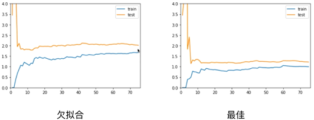
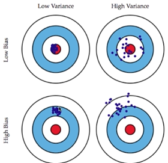

# 多项式回归与模型泛化

## 多项式回归

PolynomialFeatures(degree=3)

## 过拟合与欠拟合

过拟合与欠拟合的泛化能力都较差

过拟合（overfitting）：算法所训练的模型过多的表达了数据见的噪音关系

## 为什么要有训练数据集与测试数据集

## 学习曲线

随着训练样本的逐渐增都，算法训练出的模型的表现能力

欠拟合

过拟合

## 验证数据集与交叉验证

可能发生针对特定测试数据集过拟合了

### k-folds 交叉验证

把训练数据集分成k份，称为k-folds cross validation

缺点，每次训练k个模型，相当于整体性能慢了k倍

#### 留一法 LOO-CV

把训练数据集分成m份，称为留一法（Leave-One-Out Cross Validation），完全不受随机的影响，最接近模型真正的性能指标，缺点是计算量巨大

## 偏差和方差

有一些算法天生是高方差的算法，如 kNN。非参数学习通常都是高方差算法，因为不对数据进行任何假设。

有一些算法天生是高偏差算法，如线性回归。参数学习通常都是高偏差算法，因为对数据具有极强的假设

### 模型误差

模型误差 = 偏差（Bias） + 方差（Variance） + 不可避免的误差

### 偏差（Bias）

导致偏差的主要原因：对问题本身的假设不正确，如非线性数据使用线性回归

欠拟合 underfitting

### 方差（Variance）

数据的一点点扰动都会较大的影响模型。通常原因，使用的模型太复杂，如高阶多项式回归

过拟合 overfitting